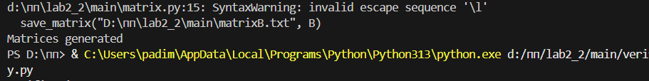
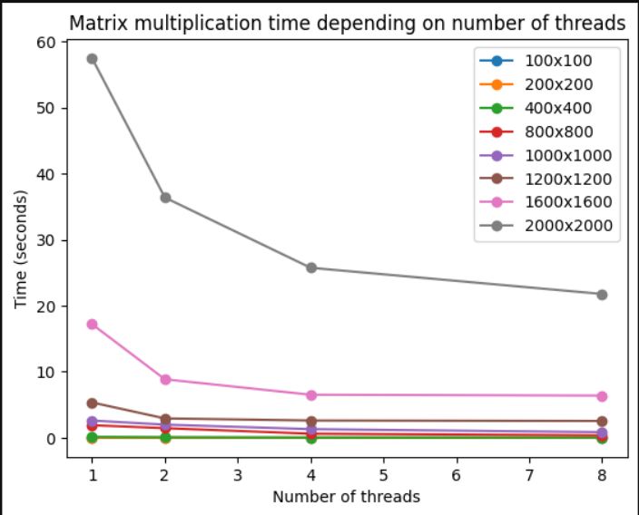

# Очет 
## Тонников Платон 6211
---

### Ход работы

В ходе лабораторной работы были сгенерированы квадратные
матрицы различных размеров при помощи matrix.py. Матрицы находятся в
файлах matrixA.txt и matrixB.txt.

При помощи main.cpp было выполнено перемножение матриц и
результат записан в result.txt

---

### Эксперименты
| Количество потоков | Размер матриц | Время |
|:-------------|:-----------:|---------:|
| 1            | 100x100   |0.0013031 |
| 2            | 100x100   |0.0015082 | 
| 4            | 100x100   |0.001857  |  
| 8            | 100x100   |0.001747  |
| 1            | 200x200   |0.0099042 |
| 2            | 200x200   |0.0082774 |
| 4            | 200x200   |0.0082291 |
| 8            | 200x200   |0.0058918 | 
| 1            | 400x400   |0.13928   |
| 2            | 400x400   |0.0873191 |
| 4            | 400x400   |0.0321978 | 
| 8            | 400x400   |0.0504842 | 
| 1            | 800x800   |1.90388   |
| 2            | 800x800   |1.45556   |
| 4            | 800x800   |0.618211  | 
| 8            | 800x800   |0.370335  | 
| 1            | 1000x1000   |2.60978   |
| 2            | 1000x1000   |1.99191   |
| 4            | 1000x1000   |1.30822   | 
| 8            | 1000x1000   |0.857455  | 
| 1            | 1200x1200   |5.34947   |
| 2            | 1200x1200   |2.93213   |
| 4            | 1200x1200   |2.61555   | 
| 8            | 1200x1200   |2.54546   | 
| 1            | 1600x1600   |17.205    |
| 2            | 1600x1600   |8.85764   |
| 4            | 1600x1600   |6.51972   | 
| 8            | 1600x1600   |6.38967   |
| 1            | 2000x2000   |57.4847   |
| 2            | 2000x2000   |36.3782   |
| 4            | 2000x2000   |25.7454   | 
| 8            | 2000x2000   |21.7766   |

---

---

## Вывод 
Исходя из проделанной работы, можно понять, что при малом размере матриц многопоточность не дает больших преимуществ выполнение.

Напротив, при большом количестве данных - время, затраченное на перемножение матриц уменьшается с увеличением числа потоков.
