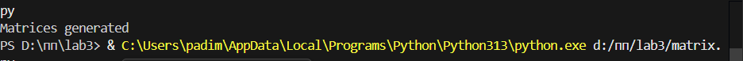
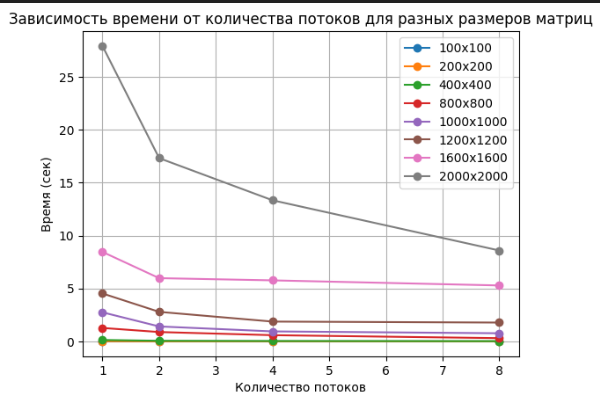

# Очет 
## Тонников Платон 6211
---

### Ход работы

В ходе лабораторной работы были сгенерированы квадратные
матрицы различных размеров при помощи matrix.py. Матрицы находятся в
файлах matrixA.txt и matrixB.txt.

При помощи lab3.cpp было выполнено перемножение матриц и
результат записан в result.txt

---

### Эксперименты
| Количество потоков | Размер матриц | Время |
|:-------------|:-----------:|---------:|
| 1            | 100x100   |0.0011539 |
| 2            | 100x100   |0.0011346 | 
| 4            | 100x100   |0.0007701 |  
| 8            | 100x100   |0.0014659 |
| 1            | 200x200   |0.0191203 |
| 2            | 200x200   |0.0055718 |
| 4            | 200x200   |0.0053952 |
| 8            | 200x200   |0.0038872 | 
| 1            | 400x400   |0.134976  |
| 2            | 400x400   |0.058712  |
| 4            | 400x400   |0.0368408 | 
| 8            | 400x400   |0.0238299 | 
| 1            | 800x800   |1.27183   |
| 2            | 800x800   |0.886106  |
| 4            | 800x800   |0.588735  | 
| 8            | 800x800   |0.307331  | 
| 1            | 1000x1000   |2.74742 |
| 2            | 1000x1000   |1.41417 |
| 4            | 1000x1000   |0.945822| 
| 8            | 1000x1000   |0.770029| 
| 1            | 1200x1200   |4.52936 |
| 2            | 1200x1200   |2.79247 |
| 4            | 1200x1200   |1.87329 | 
| 8            | 1200x1200   |1.78108 | 
| 1            | 1600x1600   |8.45662 |
| 2            | 1600x1600   |5.97783 |
| 4            | 1600x1600   |5.76965 | 
| 8            | 1600x1600   |5.2876  |
| 1            | 2000x2000   |27.9184 |
| 2            | 2000x2000   |17.3195 |
| 4            | 2000x2000   |13.3377 | 
| 8            | 2000x2000   |8.59275 |

---

---

## Вывод 
Исходя из проделанной работы, можно понять, что при малом размере матриц многопоточность не дает больших преимуществ выполнение.

Напротив, при большом количестве данных - время, затраченное на перемножение матриц уменьшается с увеличением числа потоков.
