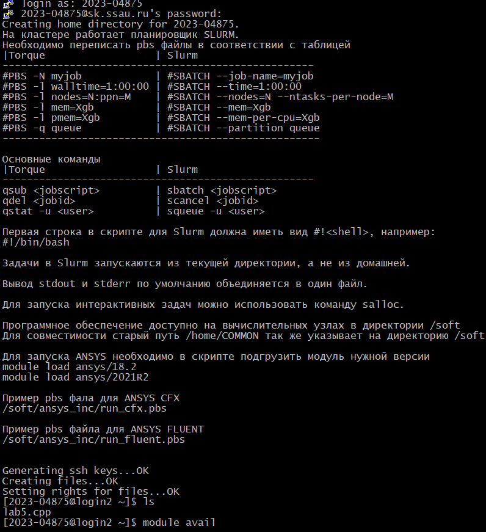
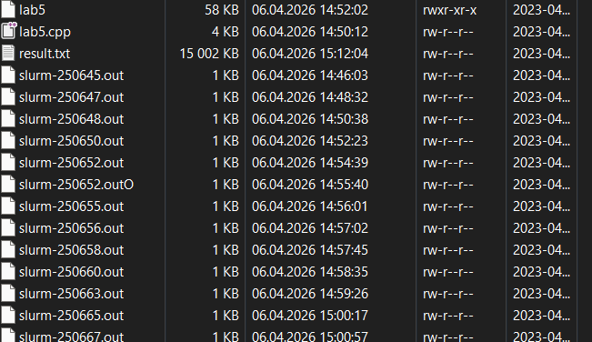
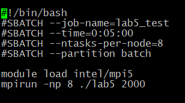
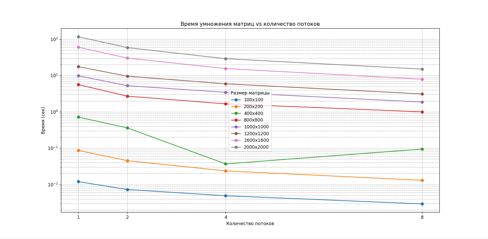

# Очет 
## Тонников Платон 6211
---

### Ход работы
В данной лабораторной работе я подключился к суперкомпьютеру.

По ходу работы были сгенерированы квадратные
матрицы различных размеров при помощи lab5.cpp на суперкомьютере "Сергей Королев" результат
перемножения находится в result.txt. 

Также для генерации был использован файл startMPI.pbs

---

### Эксперименты
| Количество потоков | Размер матриц | Время |
|:-------------|:-----------:|---------:|
| 1            | 100x100   |0.011965 |
| 2            | 100x100   |0.00726008 | 
| 4            | 100x100   |0.00488591|  
| 8            | 100x100   |0.00292015|
| 1            | 200x200   |0.0867171 |
| 2            | 200x200   |0.045192  |
| 4            | 200x200   |0.0236559 |
| 8            | 200x200   |0.013021  | 
| 1            | 400x400   |0.717648  |
| 2            | 400x400   |0.361634|
| 4            | 400x400   |0.0368408 | 
| 8            | 400x400   |0.094624  | 
| 1            | 800x800   |5.63341   |
| 2            | 800x800   |2.7041    |
| 4            | 800x800   |1.65983   | 
| 8            | 800x800   |0.999903  | 
| 1            | 1000x1000   |9.87822 |
| 2            | 1000x1000   |5.25962 |
| 4            | 1000x1000   |3.45723 | 
| 8            | 1000x1000   |1.86239 | 
| 1            | 1200x1200   |17.5774 |
| 2            | 1200x1200   |9.59252 |
| 4            | 1200x1200   |5.9272  | 
| 8            | 1200x1200   |3.11582 | 
| 1            | 1600x1600   |60.3876 |
| 2            | 1600x1600   |30.3034 |
| 4            | 1600x1600   |15.5573 | 
| 8            | 1600x1600   |7.94283 |
| 1            | 2000x2000   |117.153 |
| 2            | 2000x2000   |58.9118 |
| 4            | 2000x2000   |29.1347 | 
| 8            | 2000x2000   |15.0513 |

---

---

## Вывод 
В лабораторной работе реализовано параллельное умножение матриц с использованием MPI. Матрицы генерируются внутри программы, а строки распределяются между процессами, что позволяет ускорить вычисления. Эксперименты показали, что увеличение числа процессов существенно сокращает время выполнения, особенно для больших матриц, при этом накладные расходы на малых размерах заметны. 